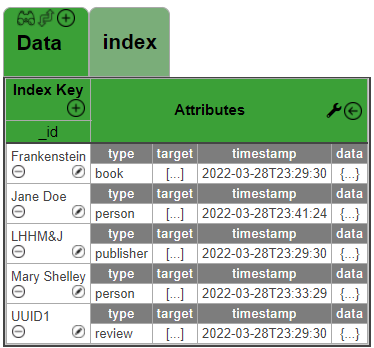

# MongoDB Index Modeler

A browser-based tool for designing and visualizing MongoDB data models, schemas, and indexes.

## Overview

The MongoDB Index Modeler allows users to visually create and experiment with document-oriented data models. It provides an intuitive interface for designing schema structures, creating indexes, and visualizing how relational data could be represented in MongoDB's document model.

The application runs entirely client-side, storing data in memory, which allows for rapid prototyping without requiring server infrastructure.



## Features

- **Visual Schema Design**: Create and edit document models with a spreadsheet-like interface
- **Document Type Management**: Define document types with associated attributes
- **Index Creation**: Design and visualize compound and multi-key indexes
- **Document Editing**: Rich JSON editor for editing complex nested documents
- **Array Expansion**: Visualize how array fields expand in indexes
- **Schema Import/Export**: Load and save models to JSON files

## Installation

The MongoDB Index Modeler runs entirely in the browser and requires no server installation.

1. Clone this repository:
```
git clone https://github.com/yourusername/mongodb-index-modeler.git
```

2. Open the `index.html` file in your browser.

## Usage

### Getting Started

1. Click the "☰ menu" button in the top-right corner
2. Select "Create Model" from the menu
3. Enter a name, author, and description for your model
4. Provide a name for your first collection
5. Begin adding documents and defining your schema

### Creating Documents

1. Click the "+" button in the "Index Keys" cell to add a new document
2. Set the "_id" and "type" values for your document
3. Add attributes by right-clicking on an attribute cell or using the context menu

### Creating Indexes

1. Click the "+" button in the upper-right corner of the tab
2. Enter a comma-separated list of attributes to index
3. Provide a name for your index

### Editing Documents

1. Click the pencil icon next to a document ID
2. Use the JSON editor to modify the document structure
3. Click "Save" to apply changes

### Value Templates

1. Right-click on an attribute cell and select "Edit Value Template"
2. Create templates with variables using `${variable}` syntax
3. Templates will be expanded when used in documents

## Project Structure

```
mongodb-index-modeler/
├── css/
│   └── main.css             # Main stylesheet
├── js/
│   ├── globals.js           # Global variables and constants
│   ├── utilities.js         # Utility functions
│   ├── model-manager.js     # Model and schema management
│   ├── ui-manager.js        # UI rendering and display
│   ├── document-operations.js  # Document CRUD operations
│   ├── event-handlers.js    # Event bindings and handlers
│   ├── jquery-3.5.1.min.js  # jQuery library
│   ├── jquery.json-editor.min.js  # JSON editor component
│   └── chance.min.js        # Random data generation library
├── img/                     # Image assets
├── data/                    # Sample data models
└── index.html               # Main application page
```

## Key Concepts

### Document Types

Each document must have a "type" attribute that defines its schema. When a document's type is set, the Index Modeler automatically adds all attributes associated with that type.

### Indexes

The primary view shows documents sorted by their "_id" field. Additional indexes can be created to visualize how documents would be organized in different access patterns.

### Array Expansion

When an index includes an array field, MongoDB creates an index entry for each array element. The Index Modeler visualizes this expansion to help understand multi-key index behavior.

### Value Templates

Value templates allow for dynamic generation of field values based on other fields in the document. Use `${fieldName}` syntax to reference other fields.

## Technologies Used

- HTML5 & CSS3
- JavaScript & jQuery
- jQuery Context Menu
- JSON Editor
- Chance.js for data generation

## Tips and Tricks

- Use the context menu (right-click) for quick access to document operations
- The "Undo" button (↩) at the top of the attributes column reverts your last change
- Use the edit button (✎) to access the full JSON editor for complex documents
- Toggle between value and schema views to see different perspectives of your data model

## License

This project is open source and available under the [MIT License](LICENSE).

## Acknowledgements

- MongoDB for the document database concepts
- OneTable for the schema format inspiration
